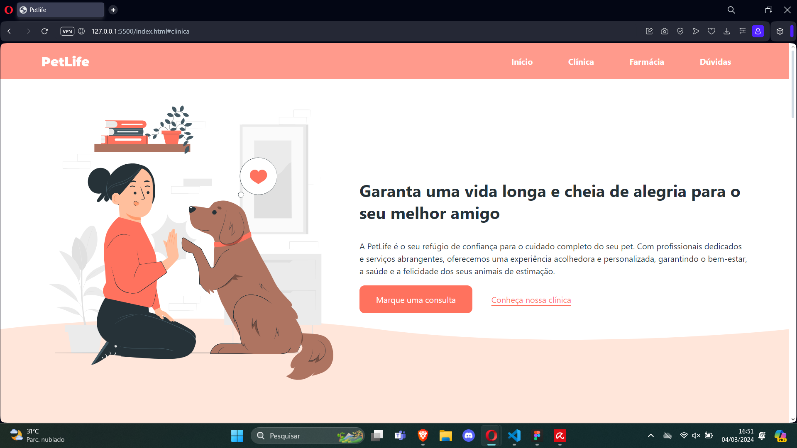
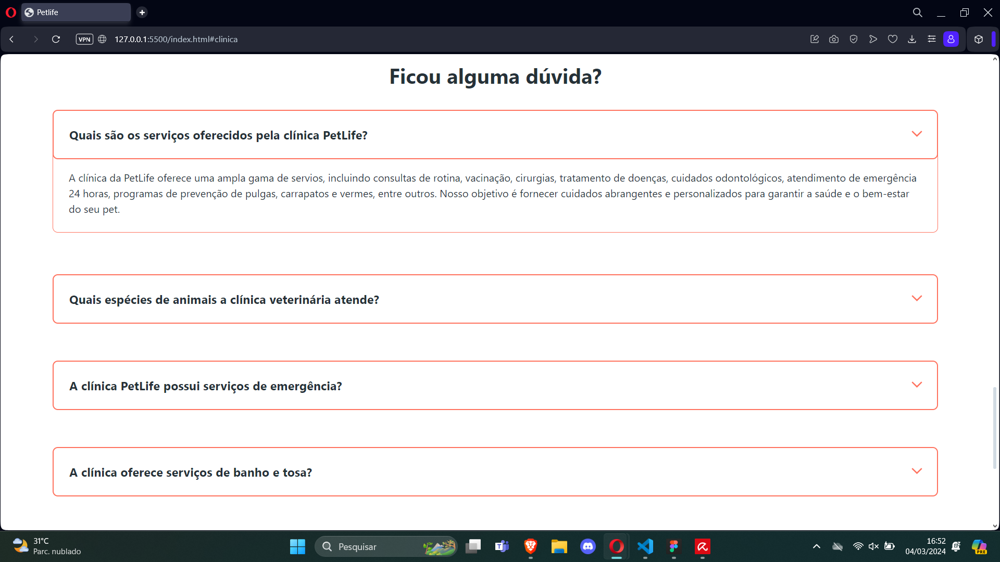

# site PetLife

Este projeto hospeda o site de um petshop fictício, no qual o cliente tem acesso à informações de infraestrutura, atendimentos e serviços. Esse projeto tem como diferenciais o design responsivo - mockups desenvolvidos no Figma - e a integração com Whatsapp e email para contato direto com atendimento.

## Veja a seguir algumas imagens do projeto:

## Tecnologias utilizadas:
- HTML
- CSS
- Javascript
- Figma (para mockups)

## Como Contribuir

Se você deseja contribuir para o desenvolvimento deste projeto, siga os passos abaixo:

1. Faça um fork do repositório.
2. Clone o repositório para sua máquina local.
3. Implemente suas melhorias ou correções.
4. Envie um pull request.

## Obrigado!
